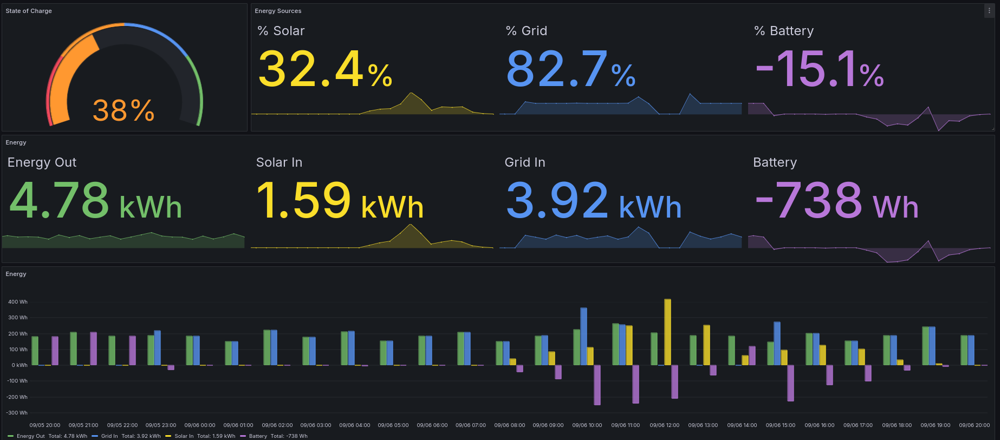

# EcoFlow 2 Influx

This is a simple utility that reads data from the EcoFlow API and writes it to an InfluxDB database. It's handy for recording a time series of data from the device so that it can be graphed in Grafana or another visualization tool.

## Usage
The easiest way to get up and running is with docker. You can run the following command to start the container:

```bash

docker run --name ecoflow2influx -d -e EcoFlowAccessKey=abc -e EcoFlowSecretKey=def -e InfluxDbUrl=http://localhost:8086 ghcr.io/binaryrefinery-dev/ecoflow2influx/ecoflow2influx

```

You can also run from source. To do so, you'll need to have the .NET Core 8 SDK installed. You can then run the following command to start the application:

```bash

dotnet run --project EcoFlow2Influx.csproj --EcoFlowAccessKey=<your access key> --EcoFlowSecretKey=<your secret key> --InfluxDbUrl=http://localhost:8086 

```

The configuration parameters are as follows and can be specified as environment variables, command line arguments, or in an `appsettings.json` file:

| Parameter        | Description                                                        |
|------------------|--------------------------------------------------------------------|
| EcoFlowUrl       | The Url of the EcoFlow API. Default is `https://api-a.ecoflow.com` |
| EcoFlowAccessKey | Your access key for the EcoFlow API                                |
| EcoFlowSecretKey | Your secret key for the EcoFlow API                                |
| InfluxDbUrl      | The URL of your InfluxDB database                                  |
| InfluxDbDatabase | The name of the database to write to. Default is "EcoFlow".        |
| InfluxDbUsername | The username to use for InfluxDB. Default is empty.                |
| InfluxDbPassword | The password to use for InfluxDB  Default is empty.                |


## Current Limitations

1. So far, this has only been tested with the EcoFlow Delta Max. It might work with other models, but some data points may be missing.
2. Only InfluxDB 1.8 has been tested. Version 2 and newer uses a different authentication scheme. 
3. Timestamps from EcoFlow are ignored and the current time that data is received from MQTT is used to write to InfluxDB.
4. Only some report types (BMS, PD, and Inverter) are saved. Other reports such as MPPT are currently ignored.

If you'd like to see support for other EcoFlow models or InfluxDB versions, please open an issue or submit a pull request.


## Grafana Dashboard
Assuming you've added an InfluxDB 1x data source to Grafana called "ecoflow" you might be able to use [the following json to create a dashboard](./Grafana/Grafana-Ecoflow%20Dashboard.json).




## How it works

This application makes use of the [EcoFlow Cloud api](https://developer.ecoflow.com/us/document/introduction) and uses a combination of the HTTP and MQTT protocols.

1. Upon startup, the application authenticates with EcoFlow using your access key and secret key.
2. It then retrieves a list of devices associated with your account.
3. For each device, it subscribes to an MQTT topic that provides near real-time data from the device.
4. When EcoFlow publishes data to the MQTT topic, the application reads the data and writes it to InfluxDB.

The data written to InfluxDB in the following Measurements:

- Battery: Information from the BMS report: Max Charge Setpoint, Min Discharge Setpoint, and State of Charge
- Inverter: Information from the Inverter report: AC In Amps, AC In Voltage, DC In Amps, DC In Voltage, Input Watts, Output Watts, Output Amps, Output Voltage, and Temperature
- Power: Information from the PD report: Inverter In Watts, Inverter Out Watts, Solar 1 Watts, Solar 2 Watts, Total Solar Watts, State of Charge, Total In Watts, and Total Out Watts.